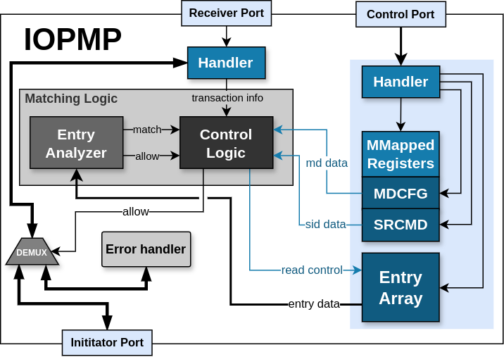
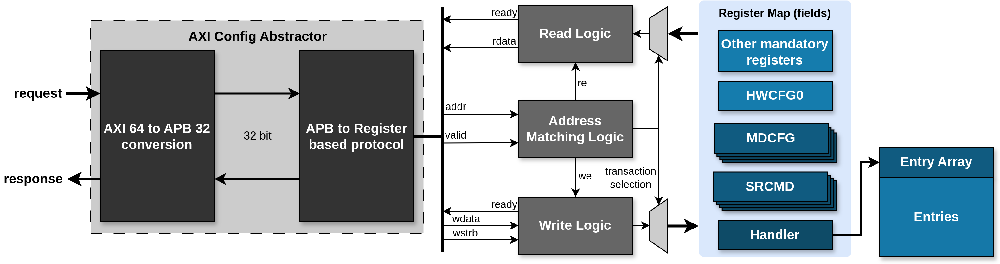
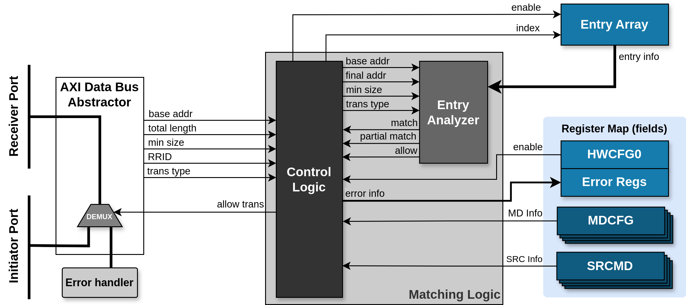
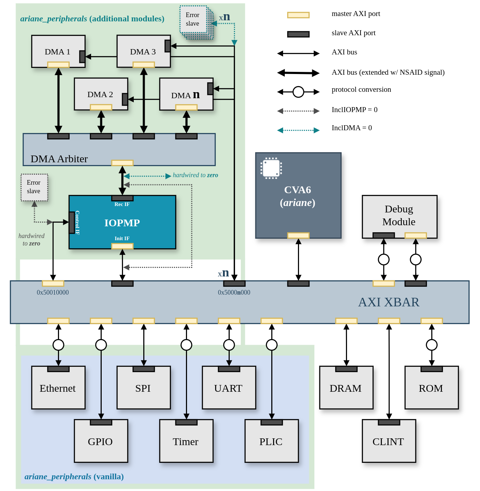

# RISC-V IOPMP

## License

This work is licensed under the Apache-2.0 License and the Solderpad Hardware License v2.1 (Apache-2.0 WITH SHL-2.1). See [LICENSE.Solerpad](./LICENSE.Solerpad) and [LICENSE.Apache](./LICENSE.Apache) files for details.

## Table of Contents

- [**RISC-V IOPMP**](#risc-v-iopmp)
  - [**License**](#license)
  - [**Table of Contents**](#table-of-contents)
  - [**About this Project**](#about-this-project)
  - [**IOPMP Features**](#iopmp-features)
  - [**Module Parameters**](#module-parameters)
  - [**IP Interfaces**](#ip-interfaces)
    - [**Control Interface**](#control-interface)
    - [**Receiver and Initiator Interfaces**](#receiver-and-initiator-interfaces)
    - [**Interrupt wires**](#interrupt-wires)
  - [**IP Integration and Validation**](#ip-integration-and-validation)
    - [**Integration into a CVA6-based SoC**](#integration-into-a-cva6-based-soc)
    - [**Functional Validation**](#functional-validation)
  - [**Tools and versions**](#tools-and-versions)
  - [**Roadmap and Contributions**](#roadmap-and-contributions)

## About this Project

This repository contains the SystemVerilog RTL implementation of an Input/Output Physical Memory Protection (IOPMP), compliant with the [RISC-V IOPMP Architecture Specification v1.0.0-draft5](https://github.com/riscv-non-isa/iopmp-spec/blob/3197348d6568799049af26f63a31d35b24fa238d/riscv_iopmp_specification.pdf). An IOPMP mediates and manages device accesses to memory by performing permission checks on non-regulated transactions.

:warning: **Disclaimer**: The IP is in constant development. We functionally validated the RISC-V IOPMP IP within a CVA6-based SoC. However, the IP is not formally verified. Thus, it is very likely to have bugs.

The microarchitecture of the IP is illustrated in the diagram below.

We classify the microarchitectural components of the IOPMP based on their functions into three primary groups:
-   **External interfaces**, used by the IOPMP to interact with other hardware subsystems within the platform. The three external interfaces are described in the [interfaces](#interfaces) section.
-   **Matching Logic** modules, which play a crucial role in the address validation process. This hardware block is responsible for mapping the received Request Role ID (RRID) to the corresponding entries and analyzing the validity of the requested transaction.
-   **Register Map** modules, contain all the configurations the IP uses to assess the validity of the requested transactions. Additionally, it features error reporting registers.

Each module is tied to one or more architectural feature and design parameter. In the [features](#iopmp-features) section, we outline the architectural features included into the IP and identify the development status of the not included optional features. In the [parameters](#module-parameters) section, we describe the modular parameters that affect the architecture and microarchitecture of the IP.

## **IOPMP Features**

The current implementation of this IP contains all the mandatory features of the version 1.0.0-draft5 of the IOPMP specification.
The following table lists all architectural features supported by this implementation, and those that may be included in the future.

| Feature | Notes | Status |
| ------------- | ------------- | ------------- |
| Configuration Protection | **(Mandatory)** Lock information in the tables   **(Optional)** MDLCK support | Only mandatory behaviour implemented |
| Programming Protection | **(Optional)** Stall and resume the transaction checks when programming the IP | Registers not implemented but the IP is stalled while configuring entries |
| Error Reporting | **(Mandatory)** Report information on failed transaction   **(Optional)** User defined violations | Only mandatory behaviour implemented | 
| Secondary Permission Setting | **(Optional)** Additional permissions on MD level | Not Implemented | 
| TOR Support | Top of Range entries support | Implemented | 
| Programmable Priority Entries | Number of priority entries configurable at run time | Implemented |

## **Module Parameters**

In order to create an adaptable and customizable IOPMP IP, we defined a set of design parameters, as detailed in the Table below. The purpose of these parameters is to manage the inclusion of some optional features, and configure microarchitectural properties of internal IOPMP structures.

| Parameter | Function | Possible values |
| ------------- | ------------- | ------------- |
| NUMBER_MDS | Define the number of MDs | 1 - 63 |
| NUMBER_SOURCES | Define the number of sources. When equal to 1, the IP is configured in Source Enforcement Mode | 1 - 65,536? | 
| NUMBER_ENTRIES | Define the number of entries | 1 - 65,536? |
| NUMBER_PRIO_ENTRIES | Default number of priority entries | 1 - 65,536? |

*? - Theoretical Max, not tested.*

:warning: **Disclaimer:** When the NUMBER_SOURCES parameter is equal to 1, the IP is automatically configured in Source Enforcement (SE) mode. In this mode the RRID is ignored.

## **IP Interfaces**

We incorporated three AXI interfaces in the IOPMP IP for system-level communication:

### **Control Interface**

Slave interface used by RISC-V harts to program and monitor the memory-mapped registers of the IOPMP.

### **Receiver and Initiator Interfaces**

The specification defines two ports for communication with the hardware: (i) Receiver Port, where the IP receives transaction requests and (ii) Initator Port, where the IP propagates the received transactions if all the checks pass. 

:warning: Currently, the only supported protocol is AXI. Additionally, we extended the default AXI interface with the NSAID field defined in the [AMBA AXI Specification](https://developer.arm.com/documentation/ihi0022/latest/) (Section A11.1). This 4 bit field supplies a Non-secure Access Identifier (NSAID) alongside the transaction request, which we use to assess the RRID of the transaction.

When the IP deems a transaction as valid, it routes the Receiver Port signals directly to the Initiator Port. On the other hand, when a transaction is invalid, an AXI Demux connects the Initiator Port to a [PULP AXI Error Slave](https://github.com/pulp-platform/axi/blob/master/src/axi_err_slv.sv), which responds to the failing request with an AXI error.

### **Interrupt wires**

The IOPMP may be configured to generate interrupts as WSIs to request service from software. For this purpose, a wire is driven by the WSI interrupt generation support module, and should be connected to a Platform-Level Interrupt Controller (e.g. PLIC/APLIC).

## **IP Integration and Validation**

The top module of the IOPMP IP is located in [rtl/riscv_iopmp.sv](./rtl/riscv_iopmp.sv). All module parameters are specifiable when instantiating this module.

### **Integration into a CVA6-based SoC**
We integrated the IOPMP IP into a [CVA6-based SoC](https://github.com/zero-day-labs/cva6/tree/feat/iommu) with support for the RISC-V hypervisor extension v1.0, along with a configurable number of instances of the [PULP iDMA](https://github.com/pulp-platform/iDMA) module to issue memory transfers.

The diagram below shows the target SoC after the integration of the IOPMP IP (and required iDMA instances). To connect multiple DMA devices to the translation request port of the IOPMP, a DMA arbiter with a single master interface is used ([rtl/dma_arb.sv](./rtl/dma_arb.sv)).

### **Functional Validation**

We implemented the CVA6-based SoC w/ IOPMP in a Genesys2 FPGA board using Vivado v2022.2. The IOPMP IP was functionally validated within this platform using one software setup:

- A [framework with baremetal tests](https://github.com/zero-day-labs/riscv-iommu-tests) to validate the included architectural features.

## **Tools and versions**

| Package/Tool  | Version |
| ------------- | ------------- |
| [verilator](https://github.com/verilator/verilator) | 4.110 |
| perl | 5.30.0 |
| make | 4.2.1 |
| python3 | 3.8.10 |
| autoconf | 2.69 |
| g++ | 9.4.0 |
| flex | 2.6.4 |
| ccache | 3.7.7 |
| bison | 3.5.1   |

## **Roadmap and Contributions**

The IOPMP specification is still under development. As such, we intend to keep updating the IP accordingly. Additionally, the IP has plenty of room for growth and improvements. We encourage contributions in many ways (but not limited to):

- Improving the current design. Increasing efficiency, modularity, scalability, etc;
- Identifying errors or bugs in the implementation, by means of formal verification, or through the integration of the IP in other systems.
